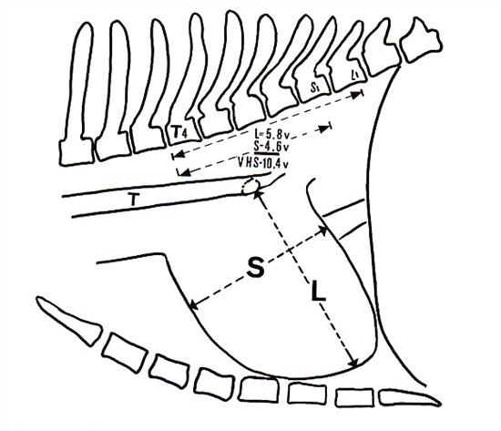
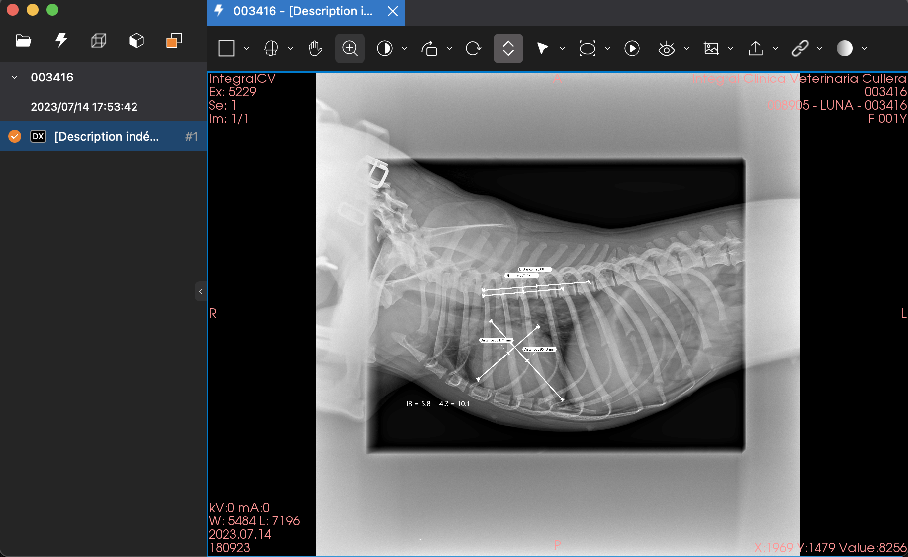
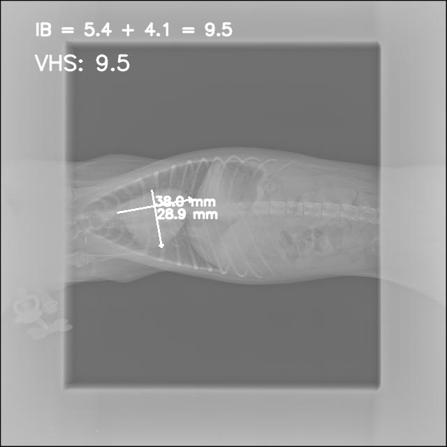
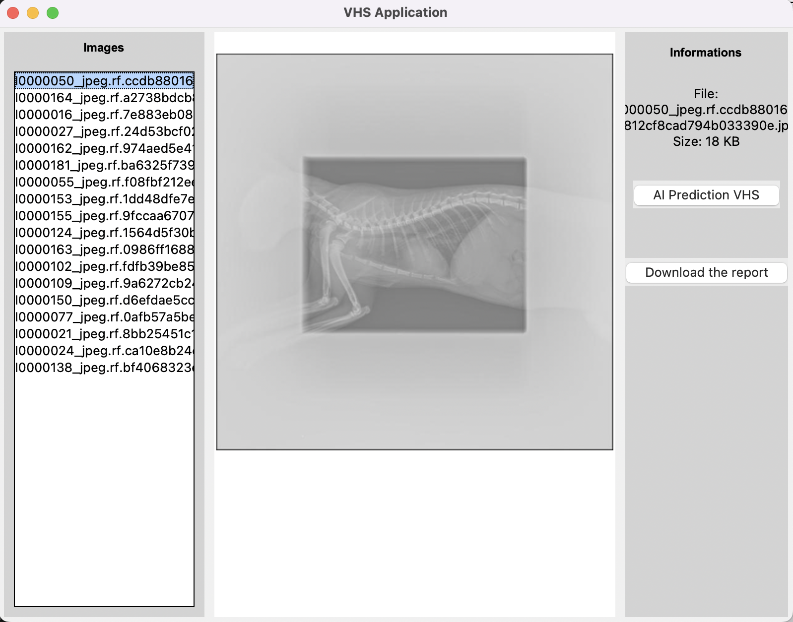
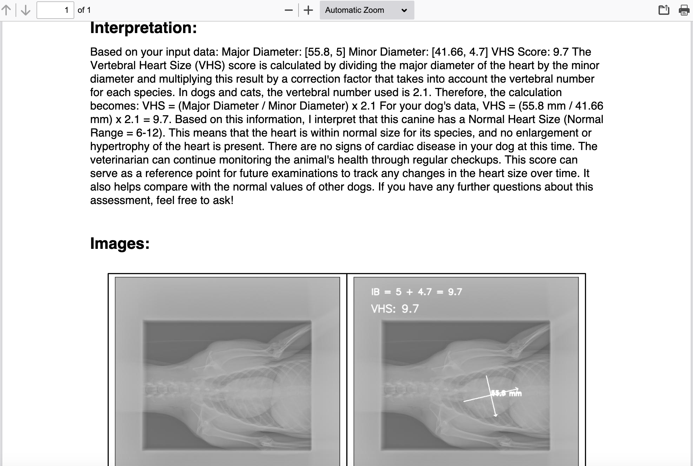

# Academic Project of the Medical and health in AI courses

*The objective is to develop an AI system capable of performing VHS analysis on animal X-rays and generating a comprehensive report containing key information and interpretation.*

**Members group:**
- FOZAME ENDEZOUMOU Armand Bryan
- NGUEMO ATONMEZE Aymard
- Harold GUEMTCHENG

**Teacher**: Ms Anudhar Kar

## Intro
Our project aims to develop an AI system capable of accurately performing the Vertebral Heart Size (VHS) assessment on animal X-rays (Figure 1). VHS is a standardized metric that normalizes heart size relative to body size, using mid-thoracic vertebrae as reference units. This research is particularly exciting as it integrates multiple advanced techniques to ensure precise and reliable results. The AI system we are building is designed to significantly enhance the efficiency of VHS assessments, enabling veterinarians and experts to save valuable time while improving diagnostic accuracy.



## Datas
About our datas, we manage dicom format on animal x-rays principally dogs and cats. You can open to have an overview of the image by using pydicom library, a python package or just find online viewer or local viewer like **Bee DICOM Viewer** on MacOS (Figure 2).



## Installation 
We performed the code on python 🐍 and to install all the dependencies just run the code after download the repository in local 

```python
pip install -r requirements.txt
```

## Our Solution
Our solution is splitted in 2 several parts:

### Computer Vision parts
We developed two models after performing manual annotations using Roboflow. The first model was designed to segment the animal’s heart, while the second model was trained to detect vertebrae, starting with a specific vertebra that serves as a reference point for measuring the long heart diameter.

For heart segmentation, we used a U-Net model, and for vertebra detection, we employed YOLO. After training these models, we developed an algorithm to analyze the segmented heart’s shape, accurately determine its major and minor diameters, and ensure that the two axes remain perpendicular.

Once the diameters were extracted, we projected them onto the vertebrae detected by YOLO. We first counted the detected vertebrae and then mapped the heart’s diameters onto the vertebral axis. The VHS score was computed based on the number of vertebrae intersected by the diameters. If a diameter was too short to fully span a vertebra, we calculated the proportion of the vertebra traversed by the diameter. If a diameter extended beyond a vertebra, we incremented the count accordingly. Finally, all values were combined to obtain the VHS score (Figure 3).

Our method is highly efficient, requiring less than 5 seconds per image. On our MacBook Pro with an M2 chip and a 10 GB GPU, we can process approximately 100 images in 500 seconds (about 8 minutes). On a more powerful machine, the process would be even faster.



### LLM parts
The second component of our solution focuses on Natural Language Processing (NLP), specifically leveraging a Large Language Model (LLM). Our objective is to automatically generate a structured report based on the VHS score and other relevant elements extracted from the input images. The report consists of several key sections:
- Patient information
- VHS measurements (major and minor diameters in millimeters, along with the VHS score)
- Interpretation
- Images (original and predicted results)

To design the report, we utilize ReportLab, a highly efficient library for generating PDF documents with structured templates. 

For the interpretation, we employ the Ollama library, integrating an LLM fine-tuned on medical datasets to ensure domain-specific accuracy and relevance. The chosen LLM is LLaMA 3.1 (Figure 4), a model with 8 billion parameters, optimized for medical applications. We carefully crafted a well-structured prompt to ensure precise and reliable model responses. 


The entire process is highly efficient, taking less than 5 seconds per report.

## Deployment
We used Flask to develop an API and built a front-end application to enhance user experience and accessibility. This beta version allows for testing and evaluating the performance of our AI solution. The figure below illustrates the system’s design.



## Results




## Discussion
The project is not yet fully completed. We have results that we can present, but further benchmarking and evaluation of our solution are needed. Additionally, optimizing and refining our code will also be considered.

Let us know if you have any questions.

## Somes References

https://www.vin.com/apputil/Project/DefaultAdv1.aspx?pid=84&id=4253805

https://www.epictrial.com/download/Guidelines-for-calculating-VHS.pdf
